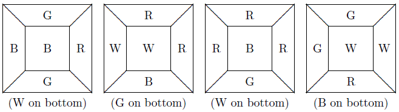

# Project 29 - Instant Insanity  

For this Project work through the discussion and do the steps to solve a somewhat challenging puzzle (many of you tried to solve this puzzle-unsuccessfully-during the first class session) by cleverly transforming a puzzle into a graph where the solution to the puzzle is fairly obvious in the graph.  

Consider the so-called Instant Insanity puzzle, which consists of these 4 cubes:  

  

There is a file ```insanity.pdf``` in the ```Documents``` folder at the course web site that you could print, cut out, and tape together to get your own set of four cubes. For class time, just use one of the sets available.  

The goal of the puzzle is to arrange the cubes in a row so that each row of four adjacent squares has each of the four colors appearing in it.  

Our purpose for this example is to show how we can transform the puzzle to a different representation and solve a related problem, leading to solution of the original problem.  

If we cleverly decide to represent the information using a graph (like with edges and vertices, not like a graph of a function), then we have to figure out what the vertices are and determine the edges. After some deep thought, and lots of playing with the cubes, we decide that we want a vertex for each color, and that whenever cube $j$ has colors $X$ and $Y$ on opposite sides we'll draw an edge, labeled with $j$, between vertices $X$ and $Y$.  

When we create the graph like this, we obtain:  

Now we solve the following transformed problem: find a tour of the graph that uses an edge for each of the cubes. One such tour is  

$$R \xrightarrow[]{\text{1}} B \xrightarrow[]{\text{3}} W \xrightarrow[]{\text{2}} G \xrightarrow[]{\text{4}} R.$$

Now, if we arrange the cubes with cube 1 first, with red in front and blue in back, cube 3 with blue in front and white in back, cube 2 with white in front and green in back, and cube 4 with green in front and red in back, we see that we have solved part of the puzzle|the front and back rows have all four colors occurring.  

Now we note that we can spin each of the cubes however we want, keeping the front and back fixed, getting whatever other pair of faces we want on the top and bottom rows. To see exactly how to do this, we go back to the graph and look for another tour, this time not using any of the edges that we have already used.  

We see that the tour  

$$R \xrightarrow[]{\text{2}} B \xrightarrow[]{\text{1}} W \xrightarrow[]{\text{4}} G \xrightarrow[]{\text{3}} R$$  

meets these requirements.  

If we spin the cubes to make the corresponding faces on the top and bottom-namely put cube 2 with red on top and blue on the bottom, cube 1 with blue on the top and white on the bottom, cube 4 with white on the top and green on the bottom, and cube 3 with green on the top and red on the bottom, then we have fully solved the puzzle.  

To check your work I will simply verify that you have solved the puzzle! This example is intended merely to suggest that changing the representation of a problem can lead to a situation where the solution is more apparent. No one is suggesting that this is not a very clever approach.
